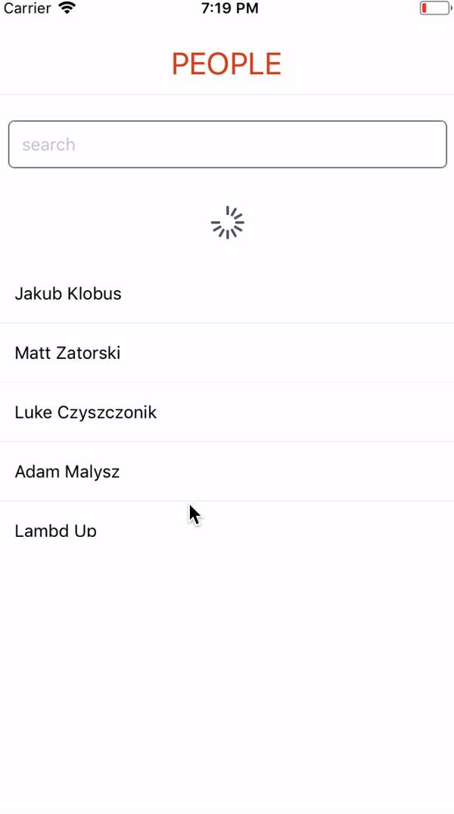

# lambdaup-reason-react-native

## Exercise
Application which render list of people. With possibility of filtering. Should implement below features:
 1.  flat list with user data
   - get data from `MockedAPI` module
   - swipe down to refresh
   - error handling (via pattern mathching on `getData` response) - app should render error code and message together with "Refresh" button
   - empty state handling (via pattern mathching on `getData` response) - for empty data app should render some message with "Refresh" button
 2. filtering - simple input and filtering by name
 3. basic styles
 4. \* show modal with picture and detailed data on item press
 5. ** use real data from https://jsonplaceholder.typicode.com/users



### MockedApi module
`getData()` function randomly returns one of these three states:
 - Response(200, list(data))
 - Response(200, [])
 - Error(code, message)

### Tips & trics
- for filtering string you can use `Js.String.filter()` function - https://bucklescript.github.io/bucklescript/api/Js.String.html 
- for refreshing FlatList by swiping down you can use `onRefresh` and `refreshing` props
- fetched data can be stored in component state (reducer) as `MockedApi.response` variant and pattern matched in render

## Build and run
### with yarn
- `yarn` - install all dependencies
- `yarn watch` - run reason compiler
- `yarn start` - start react-native packager
- scan QR code in expo app

### or with npm
- `npm install` - install all dependencies
- `npm run watch` - run reason compiler
- `npm start` - start react-native packager
- scan QR code in expo app

## Available Scripts
### `npm start`

Runs your app in development mode.

Open it in the [Expo app](https://expo.io) on your phone to view it. It will reload if you save edits to your files, and you will see build errors and logs in the terminal.

Sometimes you may need to reset or clear the React Native packager's cache. To do so, you can pass the `--reset-cache` flag to the start script:

```
npm start --reset-cache
# or
yarn start --reset-cache
```

#### `npm watch`

#### `npm build`

#### `npm run ios`

Like `npm start`, but also attempts to open your app in the iOS Simulator if you're on a Mac and have it installed.

#### `npm run android`

Like `npm start`, but also attempts to open your app on a connected Android device or emulator. Requires an installation of Android build tools (see [React Native docs](https://facebook.github.io/react-native/docs/getting-started.html) for detailed setup). We also recommend installing Genymotion as your Android emulator. Once you've finished setting up the native build environment, there are two options for making the right copy of `adb` available to Create React Native App: